<p align="center">
  
</p>
<p align="center">
  An Android app for managing SmartMailboxes.
</p>

<div align="center">
  
  
  
  
  
  
  
  
  
  
</div>

<br>

<div align="center">
  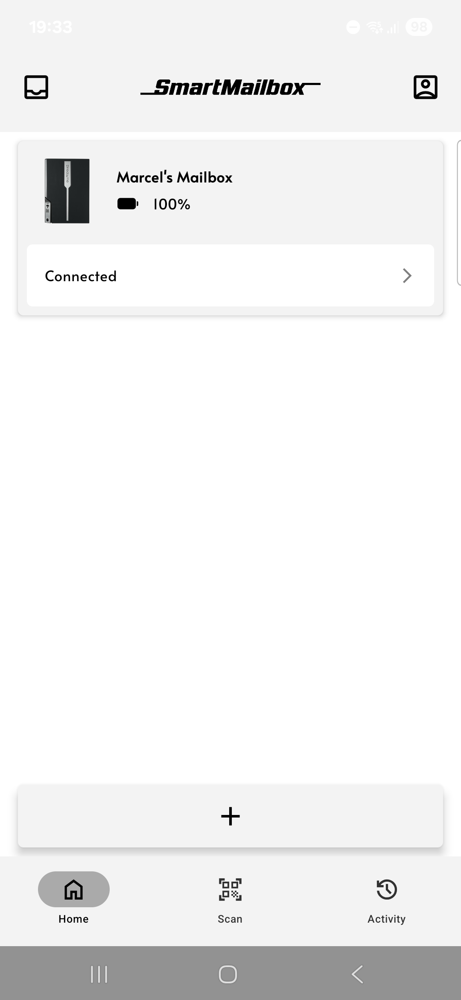
  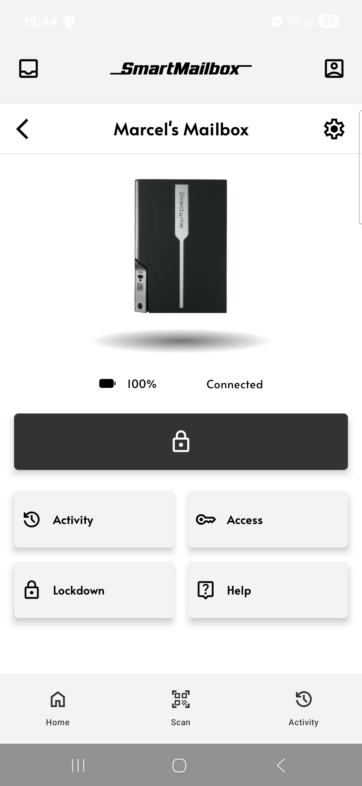
  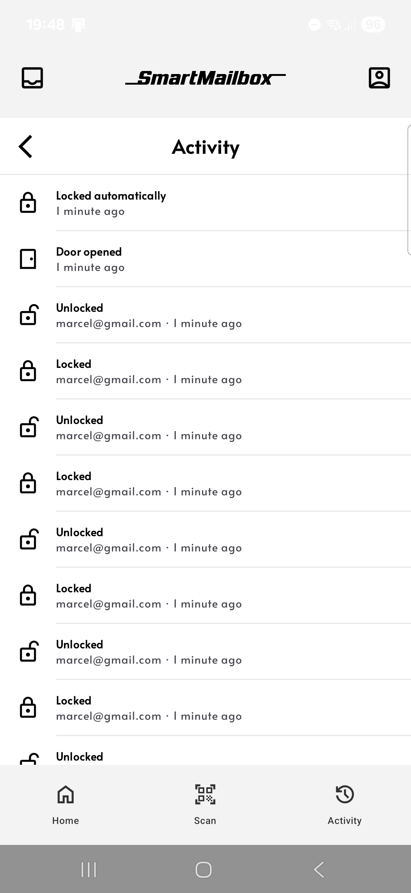
  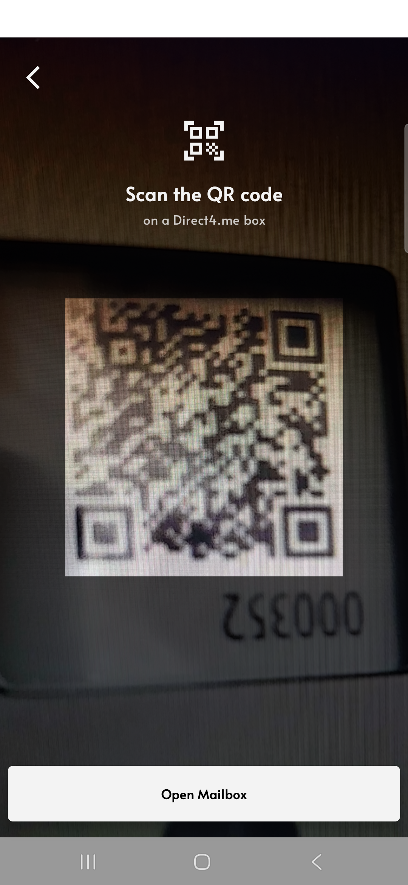
</div>

---

## 📖 About

An Android app built with Kotlin and Jetpack Compose for managing SmartMailbox devices.

Backstory: this started as a university project that didn't turn out as planned. After the course ended, I kept building on it:
- 🔄 Redesigned the app and its structure and added more features
- 🔥 Moved login and data to **Firebase Auth** and **Firestore**; the original ran on a local-only Express.js (MERN) backend


## ✨ Features

- 🔐 **Login** and **Create Account** with **Firebase Auth**
- ➕ Add a device with its unique verification code (would come with the device) and give it a name
- 📬 Manage your SmartMailbox
  - Unlock it when someone is there to deliver something
  - Lock it if no one is there yet or something is wrong
  - Auto-lock after the door closes
  - View its activity: who did what, and when
  - Manage its settings
  - Manage access with roles
    - **Admin** – all access
    - **Manager** – manage access, unlock, view activity
    - **Member** – unlock, view activity
    - **Visitor** – unlock only (e.g. a neighbor)
  - **Lockdown** – block all access when there's trouble or something valuable is inside
- 🔔 Notifications
  - Mailbox activity (unlocked, opened, locked, lockdown...)
  - Changes to your access
  - Group invites
- 📷 Scan a device's QR code to open it if you have access (e.g. a delivery person), using the **Direct4me sandbox API**
- 👤 Profile
  - Edit profile
  - Notification settings
  - Logout
- 📊 Activity – see all activity across your mailboxes, with filters

<details>
<summary>📸 All screenshots</summary>
<br>

<table align="center">
  <tr>
    <td align="center"><b>Create account</b><br>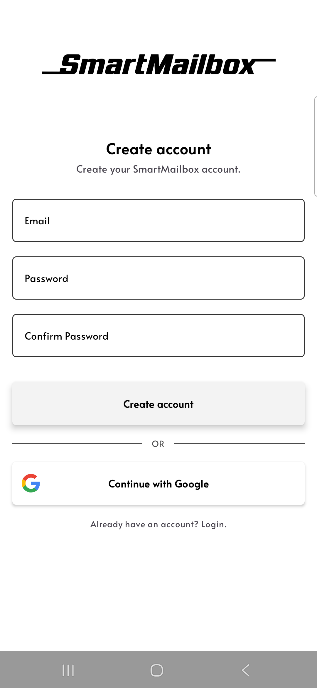</td>
    <td align="center"><b>Log in</b><br>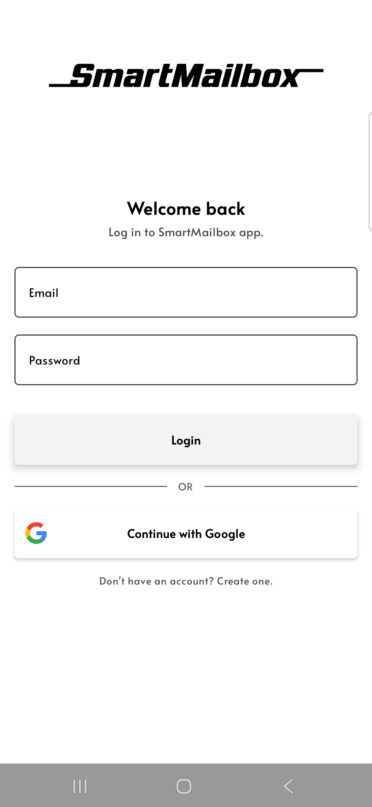</td>
    <td align="center"><b>Home (empty)</b><br>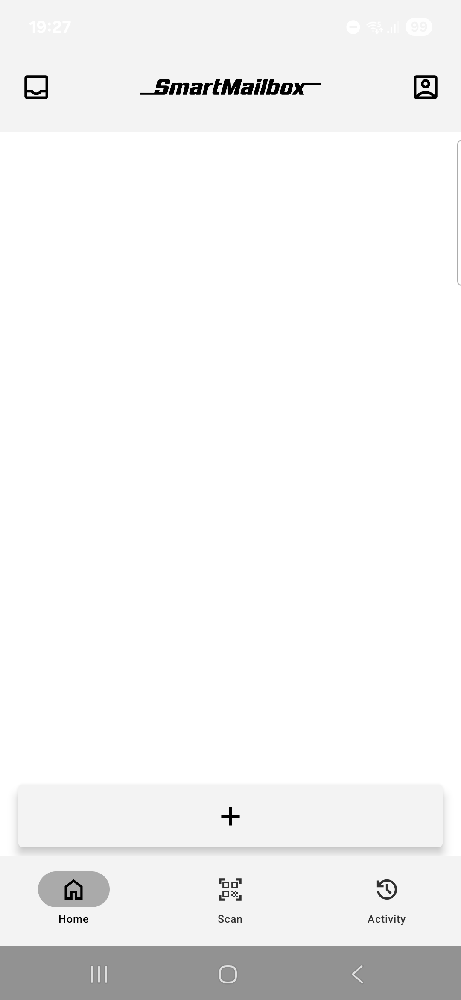</td>
  </tr>
  <tr>
    <td align="center"><b>Add mailbox: code</b><br>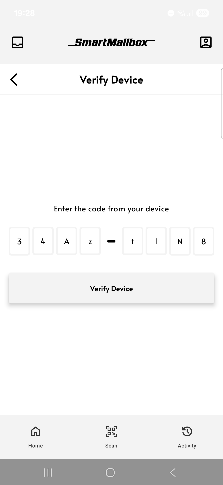</td>
    <td align="center"><b>Add mailbox: name</b><br>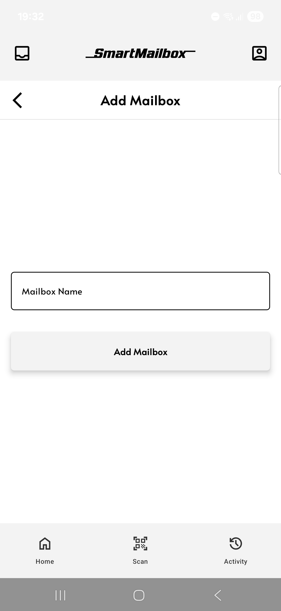</td>
    <td align="center"><b>Home</b><br></td>
  </tr>
  <tr>
    <td align="center"><b>Mailbox</b><br></td>
    <td align="center"><b>Lockdown</b><br>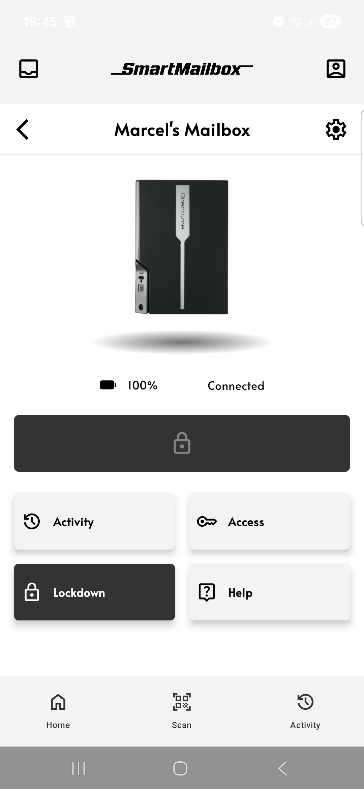</td>
    <td align="center"><b>Unlocked</b><br>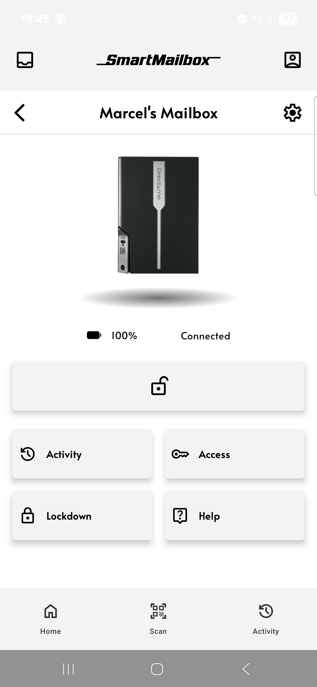</td>
  </tr>
  <tr>
    <td align="center"><b>Door open</b><br>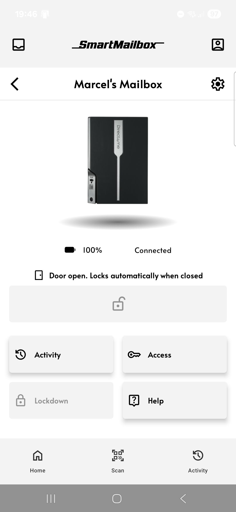</td>
    <td align="center"><b>Activity</b><br></td>
    <td align="center"><b>Scan QR code</b><br></td>
  </tr>
  <tr>
    <td align="center"><b>Unlock with sound</b><br>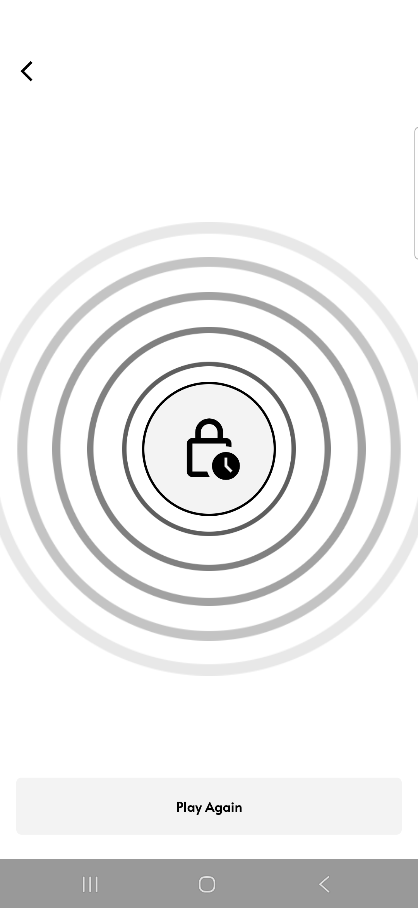</td>
    <td align="center"><b>Inbox</b><br>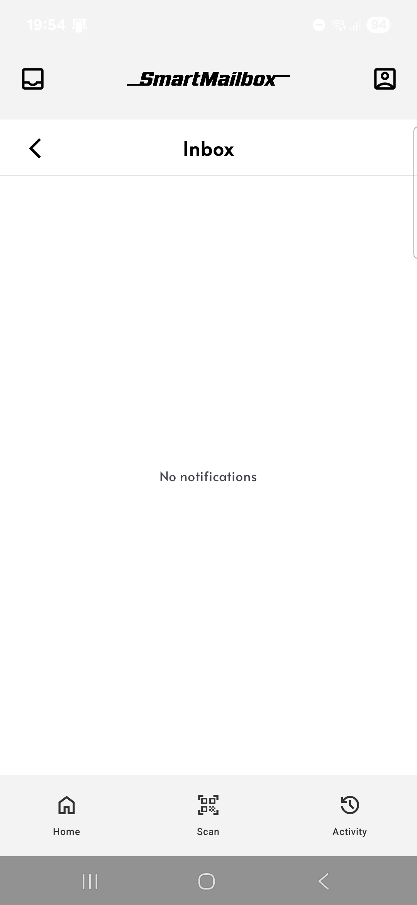</td>
    <td align="center"><b>Profile</b><br>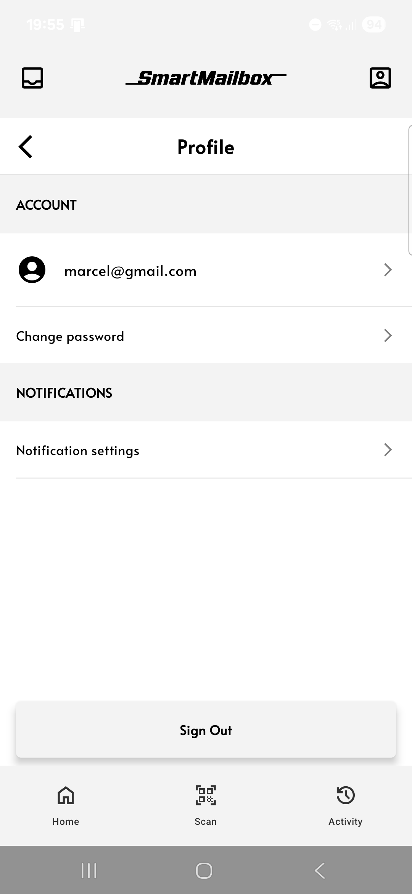</td>
  </tr>
</table>

</details>

## 💻 Tech Stack

- 🟣 Kotlin + Jetpack Compose
- 🔥 Firebase Auth (email + Google Sign-In)
- 🗄️ Cloud Firestore
- 🌐 Retrofit + Gson for the **Direct4me sandbox API**
- 📷 CameraX + ZXing for QR code scanning

## 📋 Requirements

### 📱 To use the app
- Android phone running **Android 8.0 or newer**
- Google Play Services (preinstalled on most Android phones)
- Internet connection
- Optional:
  - A SmartMailbox device with verification code or at least a generated verification code (you can also open shared mailboxes with QR code)

### 🛠️ To build and develop
- Android Studio Narwhal 3 Feature Drop (2025.1.3) or newer
- Android SDK 36 (install it in Android Studio's SDK Manager if Gradle asks for it)
- JDK 11 or newer (bundled with Android Studio)
- Android device or emulator running **Android 8.0 (API 26) or newer**
  - The app uses `java.time` (`Instant`) for mailbox activity timestamps, which is only available from API 26
- A Firebase project with **Authentication** and **Firestore** turned on
  - Place its `google-services.json` in `SmartMailBox/app/`

## 🚀 Install & Run

1. Clone the project
   ```bash
   git clone https://github.com/Maercel/smart-mailbox-android-v2.git
   ```
2. Create a Firebase project, turn on **Authentication** (Email and Google) and **Firestore**
3. Download `google-services.json` and put it in `SmartMailBox/app/`
4. *(Optional):* Add test devices to Firestore with [`seed-devices.js`](SmartMailBox/tools/seed-devices/)
5. Open the `SmartMailBox` folder in Android Studio and wait for Gradle to sync
6. Select your device or emulator and press **Run** (<kbd>Shift</kbd> + <kbd>F10</kbd>)

## 📁 Project Structure

The app is organized by feature (feature-based):

- `data/` – Firestore and API access (repositories, DTOs)
- `domain/` – models and business logic
- `ui/` – Compose screens, ViewModels and UI state

```
com.example.smartmailbox
├── auth/              # Login, register, Google sign-in
├── home/              # Your mailboxes
├── addmailbox/        # Add a device with its verification code and name it
├── mailbox/           # Scan QR code and open mailbox
├── mailboxdetail/     # Mailbox details (unlock, lock, activity, access...)
├── mailboxactivity/   # Activity history of current mailbox
├── mailboxaccess/     # Roles and access management of current mailbox
├── mailboxsettings/   # Mailbox settings of current mailbox
├── mailboxhelp/       # Help of current mailbox
├── activity/          # All activity, with filters
├── inbox/             # Notifications
├── profile/           # Profile, logout
├── navigation/        # Navigation between screens
├── api/               # Retrofit client and local data (old auth data too)
├── ui/                # Theme and shared components
└── App.kt             # App entry and navigation graph
```

## 🧪 Tests

Unit tests (JUnit) are in `SmartMailBox/app/src/test`. Run them with:

```bash
cd SmartMailBox
./gradlew test
```

Or in Android Studio: right-click the `test` folder → **Run Tests**.

---

## 🤝 Credits

- 🎓 Started as a university project with [@S1monPet](https://github.com/S1monPet)
- 📦 QR unlock via the [Direct4me](https://direct4.me) sandbox API
